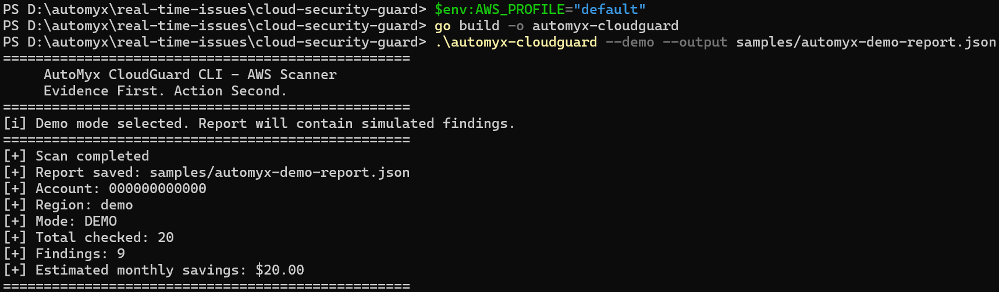
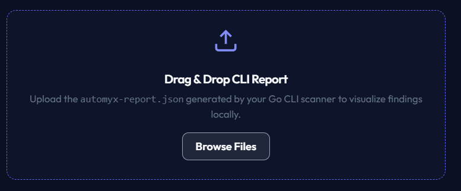
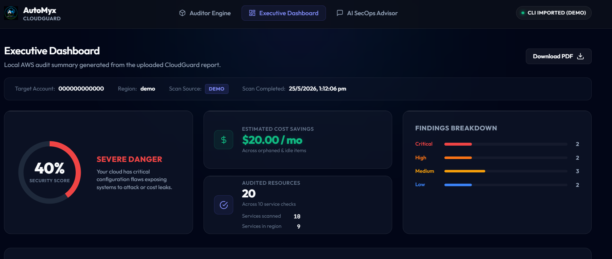
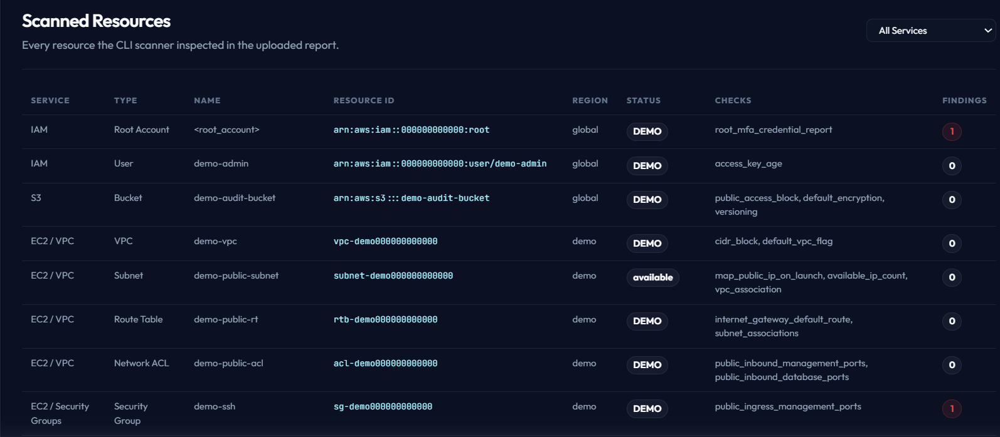
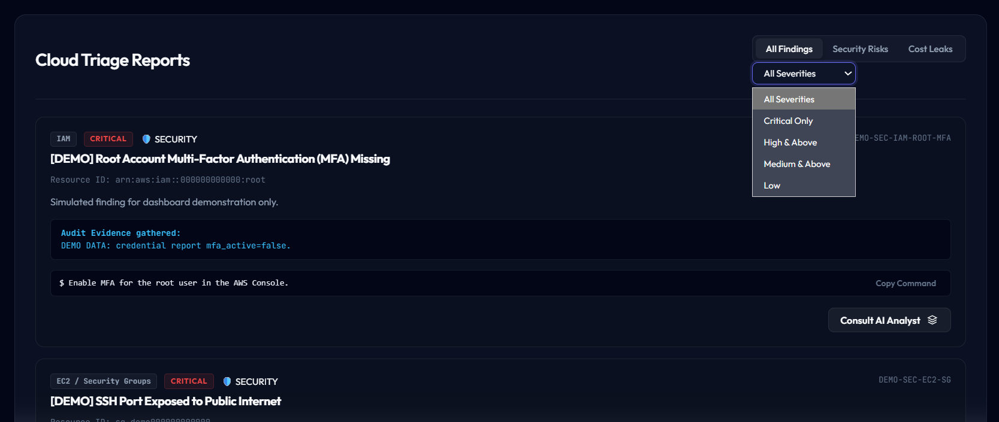
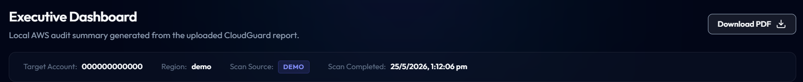

# Screenshots

Recommended public screenshots:

1. CLI scanner running in demo mode
2. Uploading `automyx-demo-report.json`
3. Executive Dashboard
4. Scanned Resources table
5. Findings list
6. Download PDF dialog or exported demo PDF preview

Use PNG for screenshots.

Recommended size:

- Desktop screenshots: `1600x900` or `1920x1080`
- Keep browser zoom at 100%
- Use demo mode or redacted data only
- Do not expose real AWS account IDs, ARNs, IP addresses, DNS records, or resource names

Suggested filenames:

- `01-cli-demo-scan.png`

- `02-upload-demo-report.png`

- `03-executive-dashboard.png`

- `04-scanned-resources.png`

- `05-findings-list.png`

- `06-export-dashboard-pdf.png`

Do not commit screenshots from a real AWS account unless fully redacted.
